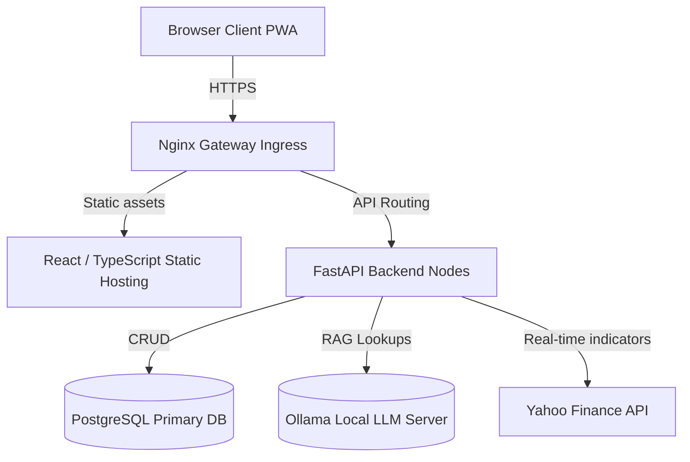
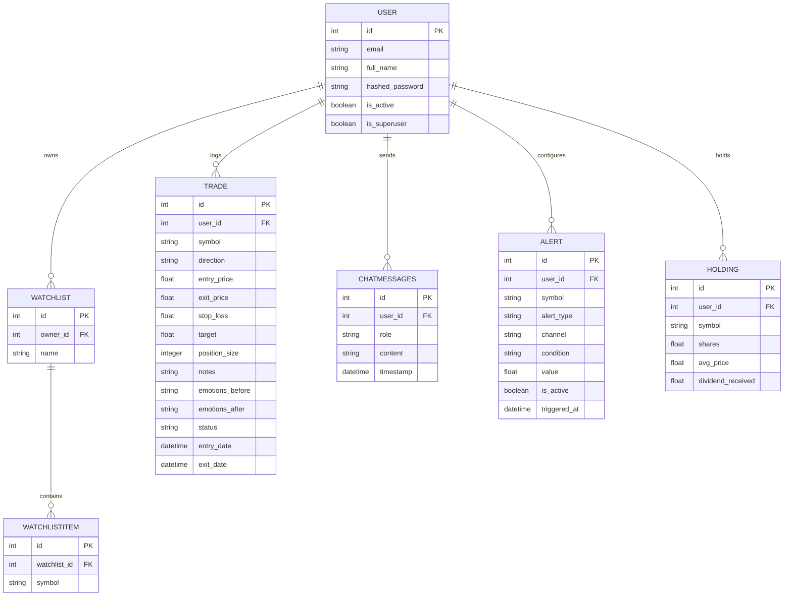

# Enterprise Architecture & Deployment Manuals

This guide details the structural layers, database configurations (SQL ER Diagrams), and production setup steps for **TechTrade**.

---

## 1. System Topology Overview



---

## 2. Database Relationship Model (ER Schema)



---

## 3. Production Deployment Guide

### local Docker Setup
1. Validate configurations in `docker-compose.yml`.
2. Build and boot services:
   ```bash
   docker-compose up --build -d
   ```
3. Backend runs at `localhost:8000/docs`, frontend at `localhost:80`.

### Kubernetes Production Setup
1. Configure context clusters and apply manifests:
   ```bash
   kubectl apply -f kubernetes/deployment.yaml
   ```
2. Verify pods and routes are active:
   ```bash
   kubectl get pods -n default
   ```
